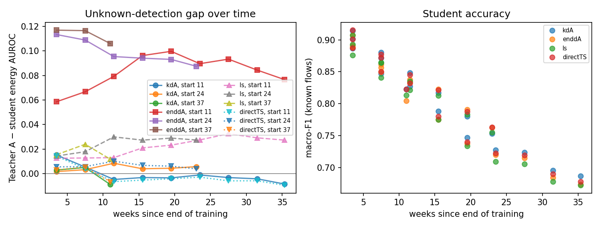
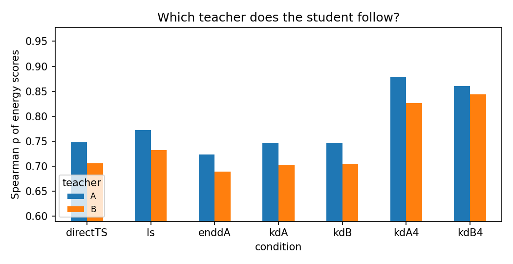

# Analysis: CONFIRMATORY

- Windows: `test`; bootstrap resamples: 1000; seed 2022
- Runs: `20260919-113607_S_train11-14` (start 11), `20260919-131820_S_train24-27` (start 24), `20260919-143354_S_train37-40` (start 37)
- Shortcut run: `20260918-234156_S_train11-14`

## Hypotheses (primary analysis, Holm-corrected)

| hypothesis | p_iut | p_holm | supported |
|---|---|---|---|
| H1 | 0.000999 | 0.008991 | True |
| H2[energy] | 1 | 1 | False |
| H2[msp] | 1 | 1 | False |
| H3[energy] | 0.993 | 1 | False |
| H3[msp] | 1 | 1 | False |
| H4a | 0.9193 | 1 | False |
| H4b1 | 0.0004731 | 0.004731 | True |
| H4b2 | 0.9984 | 1 | False |
| H5[energy] | 1 | 1 | False |
| H5[msp] | 1 | 1 | False |

## Components

| analysis | hypothesis | component | estimate | ci_low | ci_high | p_one_sided |
|---|---|---|---|---|---|---|
| primary | H1 | kdA4_shift_to_A | 0.007134 | 0.004753 | 0.00904 | 0.000999 |
| primary | H1 | kdB4_shift_to_B | 0.02551 | 0.02355 | 0.02791 | 0.000999 |
| primary | info | kdA_shift_to_A | 0.001193 | -0.0005088 | 0.003007 |  |
| primary | info | kdB_shift_to_B | -0.0001392 | -0.001344 | 0.001019 |  |
| primary | H2[energy] | auroc_kdA_minus_ls | 0.02098 | 0.014 | 0.02719 | 0.000999 |
| primary | H2[energy] | auroc_kdA_minus_directTS | -3.226e-05 | -0.001839 | 0.001703 | 0.5185 |
| primary | H2[energy] | nll_ls_minus_kdA | -0.03992 | -0.05115 | -0.02897 | 1 |
| primary | H2[energy] | nll_directTS_minus_kdA | 0.008171 | -0.0103 | 0.0276 | 0.2118 |
| primary | H3[energy] | gap_slope_per_week | -0.0003811 | -0.0006854 | -7.71e-05 | 0.993 |
| primary | H5[energy] | auroc_enddA_minus_kdA | -0.09201 | -0.09924 | -0.08437 | 1 |
| primary | info | mean_gap_teacherA_minus_kdA_energy | 0.001091 | -0.002682 | 0.005112 |  |
| primary | H2[msp] | auroc_kdA_minus_ls | 0.006214 | 0.003584 | 0.008742 | 0.000999 |
| primary | H2[msp] | auroc_kdA_minus_directTS | -0.002253 | -0.003186 | -0.001325 | 1 |
| primary | H2[msp] | nll_ls_minus_kdA | -0.03992 | -0.05115 | -0.02897 | 1 |
| primary | H2[msp] | nll_directTS_minus_kdA | 0.008171 | -0.0103 | 0.0276 | 0.2118 |
| primary | H3[msp] | gap_slope_per_week | -0.0002952 | -0.0004301 | -0.0001449 | 1 |
| primary | H5[msp] | auroc_enddA_minus_kdA | -0.007572 | -0.009394 | -0.005604 | 1 |
| primary | info | mean_gap_teacherA_minus_kdA_msp | 0.02482 | 0.02336 | 0.02638 |  |
| primary | info | raw_kdA_own_minus_other | 0.04593 | 0.04425 | 0.04748 |  |
| primary | info | raw_kdB_own_minus_other | -0.04488 | -0.04621 | -0.04375 |  |
| primary | info | f1_kdA_minus_ls | 0.00994 | 0.005153 | 0.01498 |  |
| primary | info | f1_kdA_minus_directTS | 0.0008112 | -0.00589 | 0.006678 |  |
| primary | info | ece_ls_minus_kdA | 0.0001213 | -0.001635 | 0.001878 |  |
| primary | info | ece_directTS_minus_kdA | 0.0006927 | -0.001517 | 0.002795 |  |
| drop_duplicates | H1 | kdA4_shift_to_A | 0.007194 | 0.004641 | 0.009064 | 0.000999 |
| drop_duplicates | H1 | kdB4_shift_to_B | 0.02528 | 0.02328 | 0.02777 | 0.000999 |
| drop_duplicates | info | kdA_shift_to_A | 0.001132 | -0.0006477 | 0.003007 |  |
| drop_duplicates | info | kdB_shift_to_B | -9.59e-05 | -0.001407 | 0.001128 |  |
| drop_duplicates | H2[energy] | auroc_kdA_minus_ls | 0.02542 | 0.01779 | 0.03195 | 0.000999 |
| drop_duplicates | H2[energy] | auroc_kdA_minus_directTS | -0.000425 | -0.002421 | 0.001475 | 0.6533 |
| drop_duplicates | H2[energy] | nll_ls_minus_kdA | -0.04071 | -0.05288 | -0.02976 | 1 |
| drop_duplicates | H2[energy] | nll_directTS_minus_kdA | 0.008047 | -0.01087 | 0.02942 | 0.2178 |
| drop_duplicates | H3[energy] | gap_slope_per_week | -0.0003304 | -0.0006233 | -4.676e-05 | 0.984 |
| drop_duplicates | H5[energy] | auroc_enddA_minus_kdA | -0.09349 | -0.1013 | -0.08598 | 1 |
| drop_duplicates | info | mean_gap_teacherA_minus_kdA_energy | 0.0002119 | -0.003838 | 0.003868 |  |
| drop_duplicates | H2[msp] | auroc_kdA_minus_ls | 0.007879 | 0.005234 | 0.01061 | 0.000999 |
| drop_duplicates | H2[msp] | auroc_kdA_minus_directTS | -0.002706 | -0.003582 | -0.001869 | 1 |
| drop_duplicates | H2[msp] | nll_ls_minus_kdA | -0.04071 | -0.05288 | -0.02976 | 1 |
| drop_duplicates | H2[msp] | nll_directTS_minus_kdA | 0.008047 | -0.01087 | 0.02942 | 0.2178 |
| drop_duplicates | H3[msp] | gap_slope_per_week | -0.0002518 | -0.0003909 | -0.000105 | 1 |
| drop_duplicates | H5[msp] | auroc_enddA_minus_kdA | -0.008676 | -0.01066 | -0.006794 | 1 |
| drop_duplicates | info | mean_gap_teacherA_minus_kdA_msp | 0.02391 | 0.02241 | 0.02543 |  |
| drop_duplicates | info | raw_kdA_own_minus_other | 0.04587 | 0.0441 | 0.04751 |  |
| drop_duplicates | info | raw_kdB_own_minus_other | -0.04483 | -0.04603 | -0.04372 |  |
| drop_duplicates | info | f1_kdA_minus_ls | 0.009984 | 0.00497 | 0.01511 |  |
| drop_duplicates | info | f1_kdA_minus_directTS | 0.0008349 | -0.006902 | 0.006677 |  |
| drop_duplicates | info | ece_ls_minus_kdA | -0.000737 | -0.002543 | 0.001195 |  |
| drop_duplicates | info | ece_directTS_minus_kdA | 0.0009528 | -0.001566 | 0.003057 |  |
| ge5_packets | H1 | kdA4_shift_to_A | 0.00893 | 0.006242 | 0.01102 | 0.000999 |
| ge5_packets | H1 | kdB4_shift_to_B | 0.02627 | 0.02401 | 0.02899 | 0.000999 |
| ge5_packets | info | kdA_shift_to_A | 0.00125 | -0.0005349 | 0.003289 |  |
| ge5_packets | info | kdB_shift_to_B | -3.053e-05 | -0.001626 | 0.001241 |  |
| ge5_packets | H2[energy] | auroc_kdA_minus_ls | 0.02611 | 0.01776 | 0.03254 | 0.000999 |
| ge5_packets | H2[energy] | auroc_kdA_minus_directTS | -0.0004627 | -0.002231 | 0.001312 | 0.7093 |
| ge5_packets | H2[energy] | nll_ls_minus_kdA | -0.04766 | -0.05978 | -0.03703 | 1 |
| ge5_packets | H2[energy] | nll_directTS_minus_kdA | 0.006028 | -0.01251 | 0.02608 | 0.2827 |
| ge5_packets | H3[energy] | gap_slope_per_week | -0.0002222 | -0.0005342 | 7.769e-05 | 0.9271 |
| ge5_packets | H5[energy] | auroc_enddA_minus_kdA | -0.0984 | -0.1061 | -0.09092 | 1 |
| ge5_packets | info | mean_gap_teacherA_minus_kdA_energy | -0.001347 | -0.005255 | 0.002785 |  |
| ge5_packets | H2[msp] | auroc_kdA_minus_ls | 0.008406 | 0.005755 | 0.011 | 0.000999 |
| ge5_packets | H2[msp] | auroc_kdA_minus_directTS | -0.00251 | -0.003435 | -0.001559 | 1 |
| ge5_packets | H2[msp] | nll_ls_minus_kdA | -0.04766 | -0.05978 | -0.03703 | 1 |
| ge5_packets | H2[msp] | nll_directTS_minus_kdA | 0.006028 | -0.01251 | 0.02608 | 0.2827 |
| ge5_packets | H3[msp] | gap_slope_per_week | -0.0001756 | -0.0003338 | -1.192e-05 | 0.981 |
| ge5_packets | H5[msp] | auroc_enddA_minus_kdA | -0.009594 | -0.01155 | -0.007576 | 1 |
| ge5_packets | info | mean_gap_teacherA_minus_kdA_msp | 0.02425 | 0.02271 | 0.02595 |  |
| ge5_packets | info | raw_kdA_own_minus_other | 0.04491 | 0.04315 | 0.04662 |  |
| ge5_packets | info | raw_kdB_own_minus_other | -0.04369 | -0.04509 | -0.0425 |  |
| ge5_packets | info | f1_kdA_minus_ls | 0.009713 | 0.004567 | 0.0147 |  |
| ge5_packets | info | f1_kdA_minus_directTS | 0.0008323 | -0.007358 | 0.006928 |  |
| ge5_packets | info | ece_ls_minus_kdA | -0.003338 | -0.005256 | -0.001634 |  |
| ge5_packets | info | ece_directTS_minus_kdA | 0.000988 | -0.001703 | 0.003272 |  |
| primary | H4a | reliance_kd_minus_direct | -0.0319 | -0.07102 |  | 0.9193 |
| primary | H4b1 | ece_minus_rho0 | 0.008593 | 0.006102 |  | 0.0004731 |
| primary | H4b2 | rho0_minus_auroc | -0.02006 | -0.0277 |  | 0.9984 |

## Mean over units (all flows, all unknowns)

| condition | macro_f1_mean | auroc_energy_mean | auroc_msp_mean | nll_mean | ece_mean | ece_ts_mean |
|---|---|---|---|---|---|---|
| direct | 0.8057 | 0.8352 | 0.8441 | 0.6352 | 0.04175 | 0.03416 |
| directTS | 0.8057 | 0.8345 | 0.8452 | 0.6087 | 0.03416 |  |
| enddA | 0.8005 | 0.7425 | 0.8349 | 0.555 | 0.02304 | 0.0296 |
| kdA | 0.8065 | 0.8345 | 0.8434 | 0.6298 | 0.04177 | 0.03347 |
| kdA4 | 0.7903 | 0.8089 | 0.8242 | 0.7852 | 0.08236 | 0.03677 |
| kdB | 0.806 | 0.8315 | 0.8399 | 0.6323 | 0.04266 | 0.03376 |
| kdB4 | 0.7893 | 0.81 | 0.822 | 0.8925 | 0.09027 | 0.03811 |
| ls | 0.7966 | 0.8135 | 0.8363 | 0.5665 | 0.04857 | 0.0336 |
| teacherA | 0.8601 | 0.8356 | 0.868 | 0.4759 | 0.03636 | 0.03095 |
| teacherA_member | 0.8494 | 0.8231 | 0.8491 | 0.5872 | 0.05486 | 0.03888 |
| teacherB | 0.8546 | 0.8401 | 0.8507 | 0.6234 | 0.05849 | 0.04051 |

## Figures

