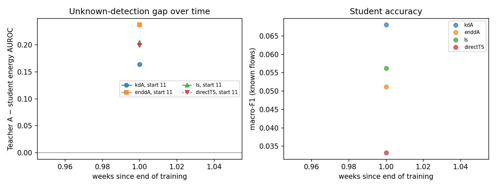
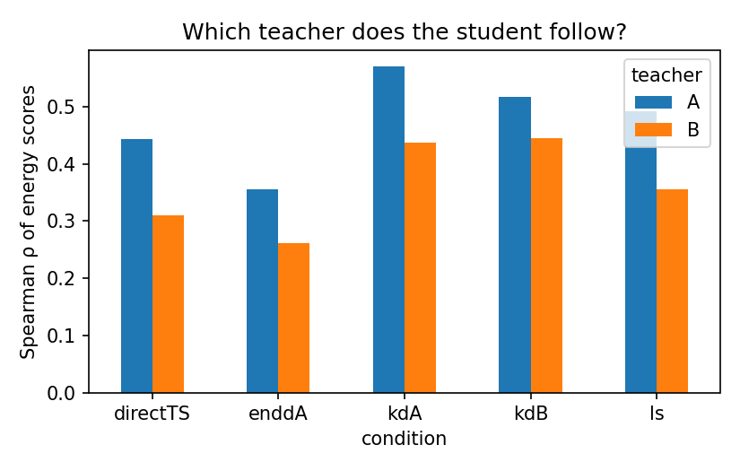

# Analysis: merge_check

- Windows: `val`; bootstrap resamples: 10; seed 2022
- Runs: `20260917-234856_XS_train11-14_smoke` (start 11), `20260917-234916_XS_train11-14_smoke` (start 11)
- Shortcut run: none (H4 not tested)
- **Not a confirmatory result:** `val` splits are not the pre-registered test windows.

## Hypotheses (primary analysis, Holm-corrected)

| hypothesis | p_iut | p_holm | supported | note |
|---|---|---|---|---|
| H1 | 0.09091 | 0.4545 | False |  |
| H2[energy] | 0.1818 | 0.7273 | False |  |
| H2[msp] | 0.1818 | 0.7273 | False |  |
| H3[energy] |  |  | False | undefined: one time point |
| H3[msp] |  |  | False | undefined: one time point |
| H5[energy] | 1 | 1 | False |  |
| H5[msp] | 1 | 1 | False |  |

## Components

| analysis | hypothesis | component | estimate | ci_low | ci_high | p_one_sided |
|---|---|---|---|---|---|---|
| primary | H1 | kdA4_shift_to_A | 0.12 | 0.09174 | 0.1334 | 0.09091 |
| primary | H1 | kdB4_shift_to_B | 0.03769 | 0.01984 | 0.06195 | 0.09091 |
| primary | info | kdA_shift_to_A | 0.01233 | -0.00496 | 0.02396 |  |
| primary | info | kdB_shift_to_B | 0.04886 | 0.03624 | 0.07067 |  |
| primary | H2[energy] | auroc_kdA_minus_ls | 0.04108 | 0.03488 | 0.05099 | 0.09091 |
| primary | H2[energy] | auroc_kdA_minus_directTS | 0.03493 | 0.02619 | 0.05634 | 0.09091 |
| primary | H2[energy] | nll_ls_minus_kdA | 0.09903 | 0.00202 | 0.1314 | 0.1818 |
| primary | H2[energy] | nll_directTS_minus_kdA | 0.2425 | 0.1354 | 0.287 | 0.09091 |
| primary | H3[energy] | gap_slope_per_week |  |  |  |  |
| primary | H5[energy] | auroc_enddA_minus_kdA | -0.07317 | -0.08206 | -0.06415 | 1 |
| primary | info | mean_gap_teacherA_minus_kdA_energy | 0.1641 | 0.1487 | 0.1848 |  |
| primary | H2[msp] | auroc_kdA_minus_ls | 0.03649 | 0.02563 | 0.04272 | 0.09091 |
| primary | H2[msp] | auroc_kdA_minus_directTS | 0.02993 | 0.01636 | 0.04672 | 0.09091 |
| primary | H2[msp] | nll_ls_minus_kdA | 0.09903 | 0.00202 | 0.1314 | 0.1818 |
| primary | H2[msp] | nll_directTS_minus_kdA | 0.2425 | 0.1354 | 0.287 | 0.09091 |
| primary | H3[msp] | gap_slope_per_week |  |  |  |  |
| primary | H5[msp] | auroc_enddA_minus_kdA | -0.06716 | -0.07229 | -0.05504 | 1 |
| primary | info | mean_gap_teacherA_minus_kdA_msp | 0.1776 | 0.1589 | 0.198 |  |
| primary | info | raw_kdA_own_minus_other | 0.1336 | 0.1174 | 0.1632 |  |
| primary | info | raw_kdB_own_minus_other | -0.07243 | -0.1022 | -0.05285 |  |
| primary | info | f1_kdA_minus_ls | 0.01177 | 0.004583 | 0.01453 |  |
| primary | info | f1_kdA_minus_directTS | 0.03481 | 0.02635 | 0.0378 |  |
| primary | info | ece_ls_minus_kdA | -0.01935 | -0.03772 | -0.002966 |  |
| primary | info | ece_directTS_minus_kdA | -0.02527 | -0.03192 | 0.001161 |  |

## Mean over units (all flows, all unknowns)

| condition | macro_f1_mean | auroc_energy_mean | auroc_msp_mean | nll_mean | ece_mean | ece_ts_mean |
|---|---|---|---|---|---|---|
| direct | 0.03321 | 0.5398 | 0.5574 | 3.476 | 0.1015 | 0.04095 |
| directTS | 0.03321 | 0.5413 | 0.5591 | 3.379 | 0.04095 |  |
| enddA | 0.05119 | 0.5031 | 0.5219 | 3.597 | 0.167 | 0.04832 |
| kdA | 0.06802 | 0.5765 | 0.5891 | 3.387 | 0.2005 | 0.06643 |
| kdA4 | 0.05744 | 0.5726 | 0.5585 | 3.504 | 0.1876 | 0.04914 |
| kdB | 0.06131 | 0.5525 | 0.5986 | 3.351 | 0.192 | 0.08036 |
| kdB4 | 0.0442 | 0.5369 | 0.5544 | 3.545 | 0.15 | 0.03955 |
| ls | 0.05625 | 0.5351 | 0.5526 | 3.386 | 0.1397 | 0.04677 |
| teacherA | 0.3793 | 0.7404 | 0.7667 | 1.819 | 0.2321 | 0.02219 |
| teacherA_member | 0.363 | 0.7326 | 0.7555 | 1.865 | 0.2028 | 0.02231 |
| teacherB | 0.4105 | 0.6835 | 0.7083 | 1.606 | 0.129 | 0.01943 |

## Figures

