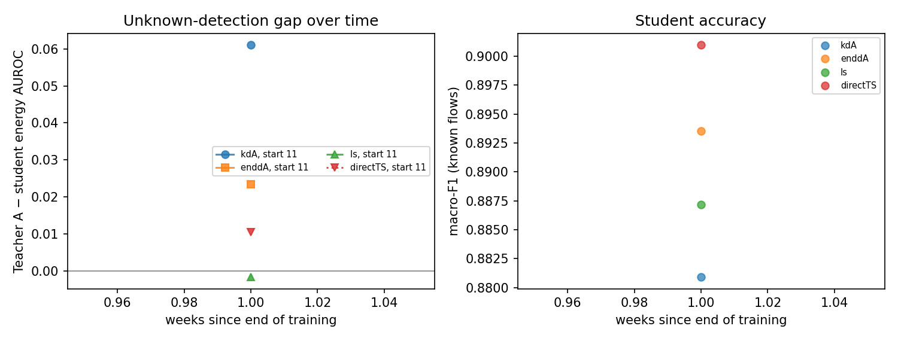
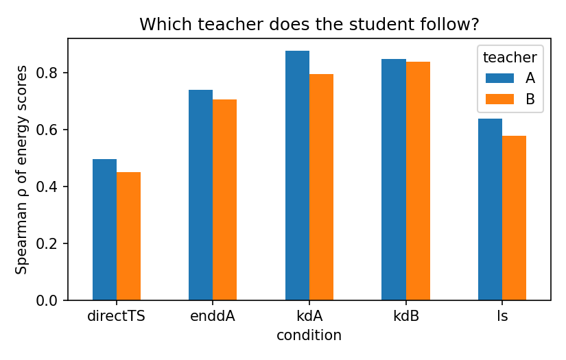

# Analysis: val_check_start11

- Windows: `val`; bootstrap resamples: 20; seed 2022
- Runs: `20260916-140053_S_train11-14` (start 11)
- Shortcut run: none (H4 not tested)
- **Not a confirmatory result:** `val` splits are not the pre-registered test windows.

## Hypotheses (primary analysis, Holm-corrected)

| hypothesis | p_iut | p_holm | supported | note |
|---|---|---|---|---|
| H1 | 0.04762 | 0.2381 | False |  |
| H2[energy] | 1 | 1 | False |  |
| H2[msp] | 1 | 1 | False |  |
| H3[energy] |  |  | False | undefined: one time point |
| H3[msp] |  |  | False | undefined: one time point |
| H5[energy] | 0.04762 | 0.2381 | False |  |
| H5[msp] | 0.04762 | 0.2381 | False |  |

## Components

| analysis | hypothesis | component | estimate | ci_low | ci_high | p_one_sided |
|---|---|---|---|---|---|---|
| primary | H1 | kdA_shift_to_A | 0.0397 | 0.0332 | 0.04701 | 0.04762 |
| primary | H1 | kdB_shift_to_B | 0.03359 | 0.02717 | 0.04087 | 0.04762 |
| primary | H2[energy] | auroc_kdA_minus_ls | -0.06206 | -0.08949 | -0.04944 | 1 |
| primary | H2[energy] | auroc_kdA_minus_directTS | -0.04987 | -0.07812 | -0.02841 | 1 |
| primary | H2[energy] | nll_ls_minus_kdA | -0.0006942 | -0.004178 | 0.004344 | 0.7619 |
| primary | H2[energy] | nll_directTS_minus_kdA | -0.04257 | -0.04605 | -0.03723 | 1 |
| primary | H3[energy] | gap_slope_per_week |  |  |  |  |
| primary | H5[energy] | auroc_enddA_minus_kdA | 0.03706 | 0.008912 | 0.06251 | 0.04762 |
| primary | info | mean_gap_teacherA_minus_kdA_energy | 0.06056 | 0.04358 | 0.08266 |  |
| primary | H2[msp] | auroc_kdA_minus_ls | -0.04045 | -0.06189 | -0.03089 | 1 |
| primary | H2[msp] | auroc_kdA_minus_directTS | -0.04432 | -0.06215 | -0.03166 | 1 |
| primary | H2[msp] | nll_ls_minus_kdA | -0.0006942 | -0.004178 | 0.004344 | 0.7619 |
| primary | H2[msp] | nll_directTS_minus_kdA | -0.04257 | -0.04605 | -0.03723 | 1 |
| primary | H3[msp] | gap_slope_per_week |  |  |  |  |
| primary | H5[msp] | auroc_enddA_minus_kdA | 0.05911 | 0.0481 | 0.07879 | 0.04762 |
| primary | info | mean_gap_teacherA_minus_kdA_msp | 0.09723 | 0.08292 | 0.1158 |  |
| primary | info | raw_kdA_own_minus_other | 0.08245 | 0.07643 | 0.08889 |  |
| primary | info | raw_kdB_own_minus_other | -0.00916 | -0.01447 | -0.003843 |  |
| primary | info | f1_kdA_minus_ls | -0.006248 | -0.009241 | -0.004128 |  |
| primary | info | f1_kdA_minus_directTS | -0.02007 | -0.02225 | -0.01758 |  |
| primary | info | ece_ls_minus_kdA | 0.001268 | -0.0001525 | 0.001749 |  |
| primary | info | ece_directTS_minus_kdA | 0.0001233 | -0.003636 | 0.00368 |  |

## Mean over units (all flows, all unknowns)

| condition | macro_f1_mean | auroc_energy_mean | auroc_msp_mean | nll_mean | ece_mean | ece_ts_mean |
|---|---|---|---|---|---|---|
| direct | 0.901 | 0.8271 | 0.8544 | 0.2425 | 0.005008 | 0.006384 |
| directTS | 0.901 | 0.8268 | 0.8545 | 0.2424 | 0.006384 |  |
| enddA | 0.8935 | 0.814 | 0.8687 | 0.2841 | 0.008504 | 0.005036 |
| kdA | 0.8809 | 0.7764 | 0.827 | 0.3576 | 0.04139 | 0.006258 |
| kdB | 0.8821 | 0.7844 | 0.8227 | 0.4052 | 0.04639 | 0.006128 |
| ls | 0.8871 | 0.839 | 0.85 | 0.3872 | 0.115 | 0.007518 |
| teacherA | 0.9639 | 0.8374 | 0.9158 | 0.0864 | 0.001441 | 0.002313 |
| teacherA_member | 0.9581 | 0.8215 | 0.8954 | 0.1044 | 0.00717 | 0.001716 |
| teacherB | 0.962 | 0.8368 | 0.9018 | 0.09652 | 0.007961 | 0.001559 |

## Figures

