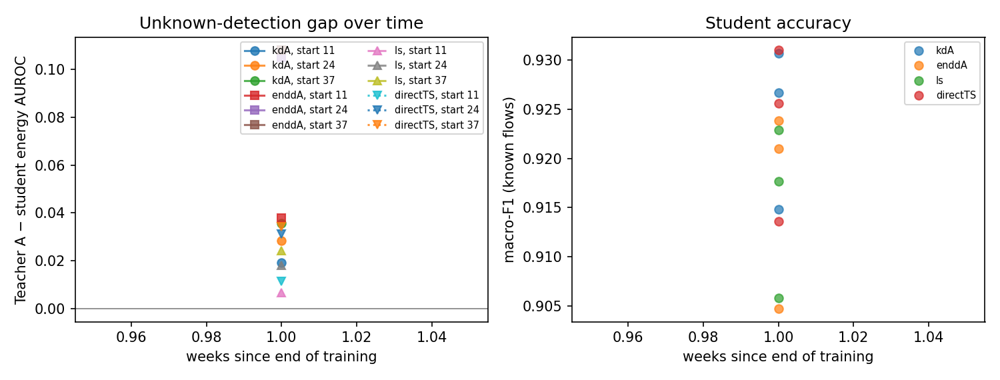
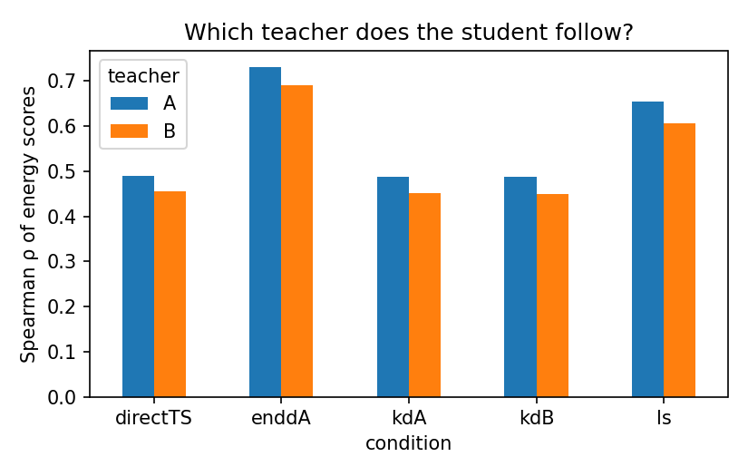
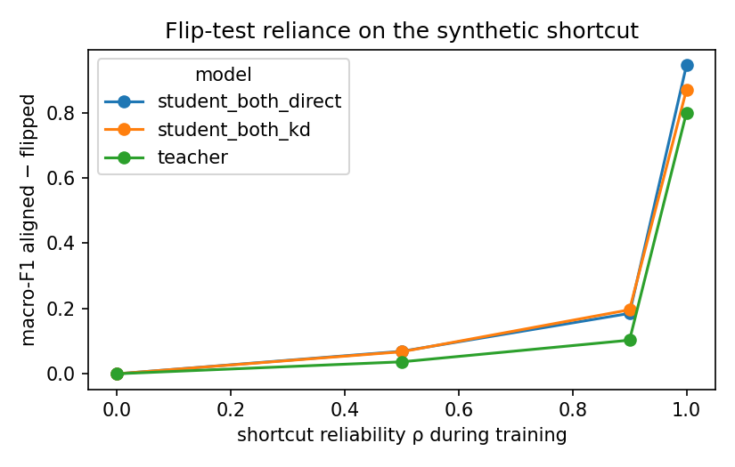

# Analysis: val_final_decisions

- Windows: `val`; bootstrap resamples: 300; seed 2022
- Runs: `20260917-110225_S_train11-14` (start 11), `20260918-121700_S_train11-14` (start 11), `20260917-121305_S_train24-27` (start 24), `20260918-124618_S_train24-27` (start 24), `20260918-132337_S_train37-40` (start 37)
- Shortcut run: `20260918-234156_S_train11-14`
- **Not a confirmatory result:** `val` splits are not the pre-registered test windows.

## Hypotheses (primary analysis, Holm-corrected)

| hypothesis | p_iut | p_holm | supported | note |
|---|---|---|---|---|
| H1 | 0.003322 | 0.02326 | True |  |
| H2[energy] | 0.9801 | 1 | False |  |
| H2[msp] | 0.9701 | 1 | False |  |
| H3[energy] |  |  | False | undefined: one time point |
| H3[msp] |  |  | False | undefined: one time point |
| H4a | 0.9193 | 1 | False |  |
| H4b1 | 0.0004731 | 0.003785 | True |  |
| H4b2 | 0.9984 | 1 | False |  |
| H5[energy] | 1 | 1 | False |  |
| H5[msp] | 0.003322 | 0.02326 | True |  |

## Components

| analysis | hypothesis | component | estimate | ci_low | ci_high | p_one_sided |
|---|---|---|---|---|---|---|
| primary | H1 | kdA4_shift_to_A | 0.04614 | 0.0393 | 0.05108 | 0.003322 |
| primary | H1 | kdB4_shift_to_B | 0.04167 | 0.03537 | 0.04875 | 0.003322 |
| primary | info | kdA_shift_to_A | 0.003026 | 0.0002234 | 0.005339 |  |
| primary | info | kdB_shift_to_B | -0.002732 | -0.004468 | -0.0009829 |  |
| primary | H2[energy] | auroc_kdA_minus_ls | -0.01137 | -0.02605 | -0.001126 | 0.9801 |
| primary | H2[energy] | auroc_kdA_minus_directTS | -0.002106 | -0.006747 | 0.002885 | 0.7475 |
| primary | H2[energy] | nll_ls_minus_kdA | 0.02434 | 0.02197 | 0.02719 | 0.003322 |
| primary | H2[energy] | nll_directTS_minus_kdA | 0.0002671 | -0.001684 | 0.002436 | 0.4153 |
| primary | H3[energy] | gap_slope_per_week |  |  |  |  |
| primary | H5[energy] | auroc_enddA_minus_kdA | -0.05582 | -0.07357 | -0.03619 | 1 |
| primary | info | mean_gap_teacherA_minus_kdA_energy | 0.02782 | 0.01527 | 0.04467 |  |
| primary | H2[msp] | auroc_kdA_minus_ls | -0.003667 | -0.01003 | 0.003294 | 0.8738 |
| primary | H2[msp] | auroc_kdA_minus_directTS | -0.003147 | -0.006298 | 5.455e-05 | 0.9701 |
| primary | H2[msp] | nll_ls_minus_kdA | 0.02434 | 0.02197 | 0.02719 | 0.003322 |
| primary | H2[msp] | nll_directTS_minus_kdA | 0.0002671 | -0.001684 | 0.002436 | 0.4153 |
| primary | H3[msp] | gap_slope_per_week |  |  |  |  |
| primary | H5[msp] | auroc_enddA_minus_kdA | 0.007559 | 0.001099 | 0.01491 | 0.003322 |
| primary | info | mean_gap_teacherA_minus_kdA_msp | 0.04411 | 0.03899 | 0.04874 |  |
| primary | info | raw_kdA_own_minus_other | 0.03536 | 0.0287 | 0.04212 |  |
| primary | info | raw_kdB_own_minus_other | -0.03506 | -0.04139 | -0.02892 |  |
| primary | info | f1_kdA_minus_ls | 0.008614 | 0.007609 | 0.009858 |  |
| primary | info | f1_kdA_minus_directTS | 0.0006649 | -0.0004945 | 0.001806 |  |
| primary | info | ece_ls_minus_kdA | -0.000171 | -0.001885 | 0.001347 |  |
| primary | info | ece_directTS_minus_kdA | -0.0003383 | -0.0009274 | 0.0003373 |  |
| drop_duplicates | H1 | kdA4_shift_to_A | 0.0477 | 0.04149 | 0.05369 | 0.003322 |
| drop_duplicates | H1 | kdB4_shift_to_B | 0.04215 | 0.03627 | 0.04853 | 0.003322 |
| drop_duplicates | info | kdA_shift_to_A | 0.002805 | 0.0005756 | 0.005289 |  |
| drop_duplicates | info | kdB_shift_to_B | -0.002744 | -0.004996 | -0.001021 |  |
| drop_duplicates | H2[energy] | auroc_kdA_minus_ls | -0.005135 | -0.01866 | 0.005789 | 0.7973 |
| drop_duplicates | H2[energy] | auroc_kdA_minus_directTS | -0.002354 | -0.007726 | 0.002057 | 0.8571 |
| drop_duplicates | H2[energy] | nll_ls_minus_kdA | 0.02588 | 0.0231 | 0.02845 | 0.003322 |
| drop_duplicates | H2[energy] | nll_directTS_minus_kdA | 6.009e-05 | -0.002272 | 0.002767 | 0.5083 |
| drop_duplicates | H3[energy] | gap_slope_per_week |  |  |  |  |
| drop_duplicates | H5[energy] | auroc_enddA_minus_kdA | -0.05569 | -0.07402 | -0.03703 | 1 |
| drop_duplicates | info | mean_gap_teacherA_minus_kdA_energy | 0.027 | 0.01353 | 0.04057 |  |
| drop_duplicates | H2[msp] | auroc_kdA_minus_ls | -0.001017 | -0.007651 | 0.005827 | 0.6379 |
| drop_duplicates | H2[msp] | auroc_kdA_minus_directTS | -0.00365 | -0.007886 | -0.0004755 | 0.9934 |
| drop_duplicates | H2[msp] | nll_ls_minus_kdA | 0.02588 | 0.0231 | 0.02845 | 0.003322 |
| drop_duplicates | H2[msp] | nll_directTS_minus_kdA | 6.009e-05 | -0.002272 | 0.002767 | 0.5083 |
| drop_duplicates | H3[msp] | gap_slope_per_week |  |  |  |  |
| drop_duplicates | H5[msp] | auroc_enddA_minus_kdA | 0.0057 | -0.0009439 | 0.01173 | 0.05316 |
| drop_duplicates | info | mean_gap_teacherA_minus_kdA_msp | 0.04211 | 0.03689 | 0.04727 |  |
| drop_duplicates | info | raw_kdA_own_minus_other | 0.0354 | 0.02863 | 0.04188 |  |
| drop_duplicates | info | raw_kdB_own_minus_other | -0.03534 | -0.04154 | -0.02858 |  |
| drop_duplicates | info | f1_kdA_minus_ls | 0.008602 | 0.007436 | 0.009847 |  |
| drop_duplicates | info | f1_kdA_minus_directTS | 0.0006911 | -0.0007166 | 0.002018 |  |
| drop_duplicates | info | ece_ls_minus_kdA | 0.001783 | 0.000354 | 0.00288 |  |
| drop_duplicates | info | ece_directTS_minus_kdA | -0.0003449 | -0.0008632 | 0.0002863 |  |
| ge5_packets | H1 | kdA4_shift_to_A | 0.05293 | 0.04682 | 0.05914 | 0.003322 |
| ge5_packets | H1 | kdB4_shift_to_B | 0.04208 | 0.0362 | 0.04821 | 0.003322 |
| ge5_packets | info | kdA_shift_to_A | 0.003341 | 0.0009865 | 0.006253 |  |
| ge5_packets | info | kdB_shift_to_B | -0.002929 | -0.00523 | -0.001239 |  |
| ge5_packets | H2[energy] | auroc_kdA_minus_ls | -0.003258 | -0.01752 | 0.008399 | 0.6944 |
| ge5_packets | H2[energy] | auroc_kdA_minus_directTS | -0.00275 | -0.008373 | 0.001717 | 0.8804 |
| ge5_packets | H2[energy] | nll_ls_minus_kdA | 0.02215 | 0.0199 | 0.02497 | 0.003322 |
| ge5_packets | H2[energy] | nll_directTS_minus_kdA | 0.0004834 | -0.001862 | 0.002987 | 0.3688 |
| ge5_packets | H3[energy] | gap_slope_per_week |  |  |  |  |
| ge5_packets | H5[energy] | auroc_enddA_minus_kdA | -0.06495 | -0.08331 | -0.0447 | 1 |
| ge5_packets | info | mean_gap_teacherA_minus_kdA_energy | 0.02197 | 0.009061 | 0.03746 |  |
| ge5_packets | H2[msp] | auroc_kdA_minus_ls | -0.0004955 | -0.007321 | 0.007517 | 0.6146 |
| ge5_packets | H2[msp] | auroc_kdA_minus_directTS | -0.003955 | -0.00815 | -0.0007682 | 0.9934 |
| ge5_packets | H2[msp] | nll_ls_minus_kdA | 0.02215 | 0.0199 | 0.02497 | 0.003322 |
| ge5_packets | H2[msp] | nll_directTS_minus_kdA | 0.0004834 | -0.001862 | 0.002987 | 0.3688 |
| ge5_packets | H3[msp] | gap_slope_per_week |  |  |  |  |
| ge5_packets | H5[msp] | auroc_enddA_minus_kdA | 0.00479 | -0.001181 | 0.01068 | 0.09302 |
| ge5_packets | info | mean_gap_teacherA_minus_kdA_msp | 0.04018 | 0.03582 | 0.04625 |  |
| ge5_packets | info | raw_kdA_own_minus_other | 0.03371 | 0.02719 | 0.04013 |  |
| ge5_packets | info | raw_kdB_own_minus_other | -0.0333 | -0.03997 | -0.0269 |  |
| ge5_packets | info | f1_kdA_minus_ls | 0.008395 | 0.007384 | 0.009711 |  |
| ge5_packets | info | f1_kdA_minus_directTS | 0.0005896 | -0.0008349 | 0.001925 |  |
| ge5_packets | info | ece_ls_minus_kdA | -0.0001621 | -0.001576 | 0.001086 |  |
| ge5_packets | info | ece_directTS_minus_kdA | -0.0003914 | -0.0009645 | 0.0001432 |  |
| primary | H4a | reliance_kd_minus_direct | -0.0319 | -0.07102 |  | 0.9193 |
| primary | H4b1 | ece_minus_rho0 | 0.008593 | 0.006102 |  | 0.0004731 |
| primary | H4b2 | rho0_minus_auroc | -0.02006 | -0.0277 |  | 0.9984 |

## Mean over units (all flows, all unknowns)

| condition | macro_f1_mean | auroc_energy_mean | auroc_msp_mean | nll_mean | ece_mean | ece_ts_mean |
|---|---|---|---|---|---|---|
| direct | 0.9234 | 0.8525 | 0.883 | 0.1843 | 0.002704 | 0.005495 |
| directTS | 0.9234 | 0.8517 | 0.8836 | 0.1832 | 0.005495 |  |
| enddA | 0.9165 | 0.7937 | 0.8873 | 0.2181 | 0.006637 | 0.004661 |
| kdA | 0.9241 | 0.8495 | 0.8817 | 0.1844 | 0.002858 | 0.005834 |
| kdA4 | 0.9014 | 0.8338 | 0.8674 | 0.2744 | 0.03199 | 0.005092 |
| kdB | 0.9231 | 0.8499 | 0.8821 | 0.1857 | 0.003206 | 0.005766 |
| kdB4 | 0.9033 | 0.8378 | 0.8632 | 0.3021 | 0.03554 | 0.004473 |
| ls | 0.9155 | 0.861 | 0.8834 | 0.2513 | 0.05879 | 0.005642 |
| teacherA | 0.9666 | 0.8773 | 0.9305 | 0.08212 | 0.002089 | 0.003323 |
| teacherA_member | 0.9617 | 0.8614 | 0.9112 | 0.09829 | 0.006495 | 0.002628 |
| teacherB | 0.9657 | 0.8787 | 0.9153 | 0.09235 | 0.006936 | 0.002889 |

## Figures

