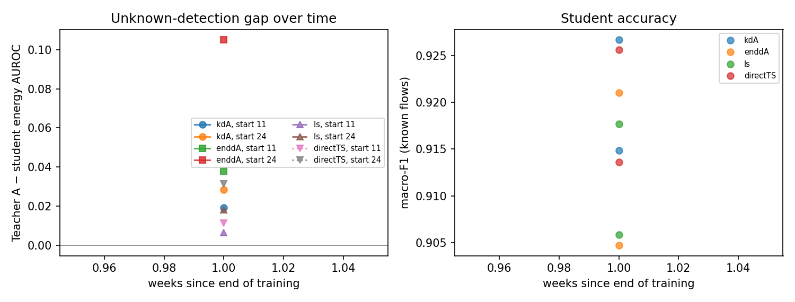
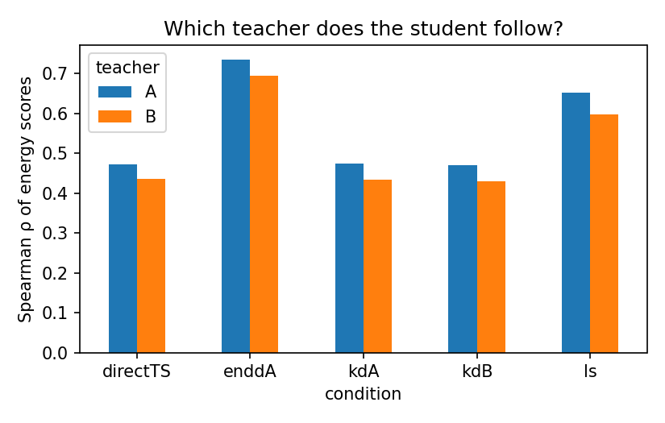

# Analysis: val_start11_24

- Windows: `val`; bootstrap resamples: 300; seed 2022
- Runs: `20260917-110225_S_train11-14` (start 11), `20260918-121700_S_train11-14` (start 11), `20260917-121305_S_train24-27` (start 24), `20260918-124618_S_train24-27` (start 24)
- Shortcut run: none (H4 not tested)
- **Not a confirmatory result:** `val` splits are not the pre-registered test windows.

## Hypotheses (primary analysis, Holm-corrected)

| hypothesis | p_iut | p_holm | supported | note |
|---|---|---|---|---|
| H1 | 0.003322 | 0.01661 | True |  |
| H2[energy] | 0.907 | 1 | False |  |
| H2[msp] | 0.8937 | 1 | False |  |
| H3[energy] |  |  | False | undefined: one time point |
| H3[msp] |  |  | False | undefined: one time point |
| H5[energy] | 1 | 1 | False |  |
| H5[msp] | 0.006645 | 0.02658 | True |  |

## Components

| analysis | hypothesis | component | estimate | ci_low | ci_high | p_one_sided |
|---|---|---|---|---|---|---|
| primary | H1 | kdA4_shift_to_A | 0.04817 | 0.04019 | 0.05702 | 0.003322 |
| primary | H1 | kdB4_shift_to_B | 0.04074 | 0.03273 | 0.04891 | 0.003322 |
| primary | info | kdA_shift_to_A | 0.00449 | 0.0009687 | 0.007212 |  |
| primary | info | kdB_shift_to_B | -0.004265 | -0.00654 | -0.002073 |  |
| primary | H2[energy] | auroc_kdA_minus_ls | -0.01139 | -0.02652 | 0.00463 | 0.907 |
| primary | H2[energy] | auroc_kdA_minus_directTS | -0.002526 | -0.007447 | 0.003324 | 0.7973 |
| primary | H2[energy] | nll_ls_minus_kdA | 0.02411 | 0.02146 | 0.02688 | 0.003322 |
| primary | H2[energy] | nll_directTS_minus_kdA | 0.002032 | -0.0007917 | 0.004792 | 0.06312 |
| primary | H3[energy] | gap_slope_per_week |  |  |  |  |
| primary | H5[energy] | auroc_enddA_minus_kdA | -0.04756 | -0.06906 | -0.02829 | 1 |
| primary | info | mean_gap_teacherA_minus_kdA_energy | 0.02392 | 0.006066 | 0.04128 |  |
| primary | H2[msp] | auroc_kdA_minus_ls | -0.005306 | -0.01236 | 0.003318 | 0.8937 |
| primary | H2[msp] | auroc_kdA_minus_directTS | -0.002805 | -0.007786 | 0.001385 | 0.8605 |
| primary | H2[msp] | nll_ls_minus_kdA | 0.02411 | 0.02146 | 0.02688 | 0.003322 |
| primary | H2[msp] | nll_directTS_minus_kdA | 0.002032 | -0.0007917 | 0.004792 | 0.06312 |
| primary | H3[msp] | gap_slope_per_week |  |  |  |  |
| primary | H5[msp] | auroc_enddA_minus_kdA | 0.01179 | 0.001789 | 0.02114 | 0.006645 |
| primary | info | mean_gap_teacherA_minus_kdA_msp | 0.04476 | 0.03875 | 0.05157 |  |
| primary | info | raw_kdA_own_minus_other | 0.03831 | 0.0295 | 0.04603 |  |
| primary | info | raw_kdB_own_minus_other | -0.03808 | -0.04511 | -0.02935 |  |
| primary | info | f1_kdA_minus_ls | 0.008989 | 0.007549 | 0.01082 |  |
| primary | info | f1_kdA_minus_directTS | 0.001138 | -0.0003197 | 0.002881 |  |
| primary | info | ece_ls_minus_kdA | -0.0002814 | -0.002506 | 0.001477 |  |
| primary | info | ece_directTS_minus_kdA | -0.0003169 | -0.0008767 | 0.0004054 |  |

## Mean over units (all flows, all unknowns)

| condition | macro_f1_mean | auroc_energy_mean | auroc_msp_mean | nll_mean | ece_mean | ece_ts_mean |
|---|---|---|---|---|---|---|
| direct | 0.9196 | 0.8512 | 0.8787 | 0.1895 | 0.002708 | 0.005624 |
| directTS | 0.9196 | 0.8505 | 0.8792 | 0.1886 | 0.005624 |  |
| enddA | 0.9129 | 0.8004 | 0.8874 | 0.2229 | 0.00688 | 0.00433 |
| kdA | 0.9208 | 0.848 | 0.8779 | 0.1876 | 0.002487 | 0.005945 |
| kdA4 | 0.8978 | 0.8298 | 0.8627 | 0.2776 | 0.03228 | 0.005005 |
| kdB | 0.9198 | 0.8483 | 0.8784 | 0.1886 | 0.002692 | 0.005733 |
| kdB4 | 0.8999 | 0.831 | 0.8555 | 0.3082 | 0.03634 | 0.004775 |
| ls | 0.9118 | 0.8594 | 0.8809 | 0.2557 | 0.0598 | 0.00564 |
| teacherA | 0.9656 | 0.8718 | 0.9279 | 0.08225 | 0.002049 | 0.00325 |
| teacherA_member | 0.96 | 0.8564 | 0.909 | 0.09917 | 0.006639 | 0.002547 |
| teacherB | 0.9644 | 0.8692 | 0.9127 | 0.09268 | 0.006991 | 0.003003 |

## Figures

